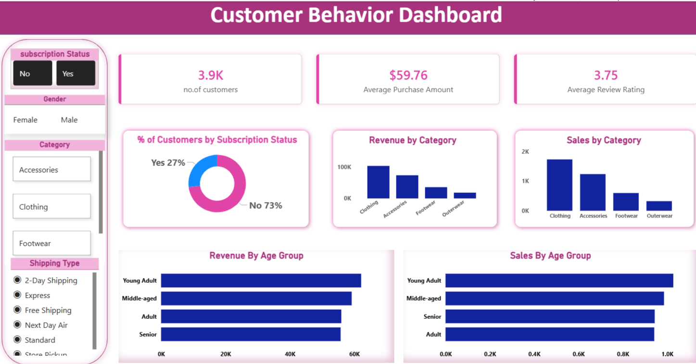

<div align="center">

# 🛍️ Customer Shopping Behavior Analysis

### End-to-End Analysis Pipeline: Python (Cleaning) → PostgreSQL (SQL) → Power BI (Dashboard)


<!-- 📸 Add a real screenshot of the Power BI dashboard here --> 

</div>

---

## 📌 Overview

This project delivers a complete, real-world **customer shopping behavior analysis pipeline**, taking a raw retail dataset from messy CSV all the way to a stakeholder-ready interactive dashboard, across three connected stages:

1. **Python (Pandas)** — clean, standardize, and engineer features from raw transaction data
2. **PostgreSQL (SQL)** — load the cleaned data into a relational database and answer **10 core business questions**
3. **Power BI** — visualize the same data as a single-page interactive dashboard with KPIs, charts, and slicers

The dataset covers **3,900 customer transactions**, capturing demographics, product categories, pricing, ratings, discounts, subscriptions, and shipping behavior — enough to build a genuine picture of who buys what, how often, and under what conditions.

---


---

## 🧮 Dataset Description

| Property | Value |
|---|---|
| **Rows** | 3,900 customer records |
| **Columns (post-cleaning)** | 19 |
| **Categories** | Clothing, Footwear, Outerwear, Accessories |
| **Genders** | Male, Female |
| **Age Range** | 18 – 70 |
| **Locations** | 50 (U.S. states) |
| **Payment Methods** | Venmo, Cash, Credit Card, PayPal, Bank Transfer, Debit Card |
| **Purchase Frequency Labels** | Weekly, Fortnightly, Bi-Weekly, Monthly, Quarterly, Every 3 Months, Annually |

### Key Columns

| Column | Description |
|---|---|
| `customer_id` | Unique customer identifier |
| `age` / `age_group` | Customer age and engineered quartile-based age bracket |
| `gender` | Customer gender |
| `item_purchased` / `category` | Product bought and its category |
| `purchase_amount` | Transaction value (USD) |
| `review_rating` | Product rating (1–5) |
| `subscription_status` | Whether the customer is an active subscriber |
| `shipping_type` | Delivery method chosen |
| `discount_applied` | Whether a discount was used on the purchase |
| `previous_purchases` | Number of prior purchases by the customer |
| `payment_method` | Payment method used |
| `frequency_of_purchases` / `purchase_frequency_days` | Stated purchase cadence, converted to an approximate day count |

---

## 🧹 Stage 1 — Data Cleaning & Feature Engineering (Python)

All cleaning was performed in Pandas (`Customer_Behavior_analysis.ipynb`) before the data reached SQL or Power BI:

1. **Missing values** — 37 missing `review_rating` values were filled using the **median rating within each product category** (`groupby('category').transform(median)`), preserving category-level rating patterns instead of using one global average.
2. **Column standardization** — all column names converted to `snake_case` (e.g. `Purchase Amount (USD)` → `purchase_amount`).
3. **Redundant column removal** — `discount_applied` and `promo_code_used` were found to be **100% identical** across all 3,900 rows, so `promo_code_used` was dropped.
4. **Feature engineering — `age_group`** — customers split into 4 quantile-based brackets (`Young Adult`, `Adult`, `Middle-aged`, `Senior`) using `pd.qcut`.
5. **Feature engineering — `purchase_frequency_days`** — the categorical `frequency_of_purchases` field (e.g. "Weekly", "Fortnightly") mapped to an approximate numeric day interval for trend analysis.
6. **Export & load** — the cleaned DataFrame exported to CSV and loaded into a **PostgreSQL** database (`customer_behaviour`) via `SQLAlchemy`, into a table named `customer`.

---

## ❓ Stage 2 — Business Questions Answered (SQL)

All 10 queries run against the `customer` table in PostgreSQL — full code in [`customer_behavior_sql_queries.sql`](./customer_behavior_sql_queries.sql).

| # | Business Question | SQL Technique Used |
|---|---|---|
| **Q1** | What is the total revenue generated by male vs. female customers? | `GROUP BY` + `SUM` |
| **Q2** | Which customers used a discount but still spent more than the average purchase amount? | Correlated subquery |
| **Q3** | Which are the top 5 products with the highest average review rating? | `GROUP BY` + `ORDER BY` + `LIMIT` |
| **Q4** | How do average purchase amounts compare between Standard and Express shipping? | Filtered aggregation |
| **Q5** | Do subscribed customers spend more? (avg. spend & total revenue: subscribers vs. non-subscribers) | Multi-metric `GROUP BY` |
| **Q6** | Which 5 products have the highest percentage of purchases made with a discount applied? | Conditional aggregation (`CASE WHEN`) |
| **Q7** | Segment customers into New, Returning, and Loyal based on purchase history | CTE + `CASE` segmentation |
| **Q8** | What are the top 3 most purchased products within each category? | Window function `ROW_NUMBER() OVER (PARTITION BY...)` |
| **Q9** | Are repeat buyers (5+ previous purchases) more likely to hold an active subscription? | Filtered `GROUP BY` |
| **Q10** | What is the revenue contribution of each customer age group? | `GROUP BY` + `SUM` + `ORDER BY` |

<details>
<summary><strong>📄 View full SQL code</strong></summary>

```sql
--Q1. What is the total revenue generated by male vs. female customers?
SELECT gender, SUM(purchase_amount) AS revenue
FROM customer
GROUP BY gender;

--Q2. Which customers used a discount but still spent more than the average purchase amount?
SELECT customer_id, purchase_amount
FROM customer
WHERE discount_applied = 'Yes'
  AND purchase_amount >= (SELECT AVG(purchase_amount) FROM customer);

--Q3. Which are the top 5 products with the highest average review rating?
SELECT item_purchased, ROUND(AVG(review_rating::numeric), 2) AS "Average Product Rating"
FROM customer
GROUP BY item_purchased
ORDER BY AVG(review_rating) DESC
LIMIT 5;

--Q4. Compare the average Purchase Amounts between Standard and Express Shipping.
SELECT shipping_type, ROUND(AVG(purchase_amount), 2)
FROM customer
WHERE shipping_type IN ('Standard', 'Express')
GROUP BY shipping_type;

--Q5. Do subscribed customers spend more? Compare average spend and total revenue
--between subscribers and non-subscribers.
SELECT subscription_status,
       COUNT(customer_id) AS total_customers,
       ROUND(AVG(purchase_amount), 2) AS avg_spend,
       ROUND(SUM(purchase_amount), 2) AS total_revenue
FROM customer
GROUP BY subscription_status
ORDER BY total_revenue, avg_spend DESC;

--Q6. Which 5 products have the highest percentage of purchases with discounts applied?
SELECT item_purchased,
       ROUND(100.0 * SUM(CASE WHEN discount_applied = 'Yes' THEN 1 ELSE 0 END) / COUNT(*), 2) AS discount_rate
FROM customer
GROUP BY item_purchased
ORDER BY discount_rate DESC
LIMIT 5;

--Q7. Segment customers into New, Returning, and Loyal based on their total
--number of previous purchases, and show the count of each segment.
WITH customer_type AS (
    SELECT customer_id, previous_purchases,
    CASE
        WHEN previous_purchases = 1 THEN 'New'
        WHEN previous_purchases BETWEEN 2 AND 10 THEN 'Returning'
        ELSE 'Loyal'
    END AS customer_segment
    FROM customer
)
SELECT customer_segment, COUNT(*) AS "Number of Customers"
FROM customer_type
GROUP BY customer_segment;

--Q8. What are the top 3 most purchased products within each category?
WITH item_counts AS (
    SELECT category,
           item_purchased,
           COUNT(customer_id) AS total_orders,
           ROW_NUMBER() OVER (PARTITION BY category ORDER BY COUNT(customer_id) DESC) AS item_rank
    FROM customer
    GROUP BY category, item_purchased
)
SELECT item_rank, category, item_purchased, total_orders
FROM item_counts
WHERE item_rank <= 3;

--Q9. Are customers who are repeat buyers (more than 5 previous purchases) also likely to subscribe?
SELECT subscription_status,
       COUNT(customer_id) AS repeat_buyers
FROM customer
WHERE previous_purchases > 5
GROUP BY subscription_status;

--Q10. What is the revenue contribution of each age group?
SELECT age_group,
       SUM(purchase_amount) AS total_revenue
FROM customer
GROUP BY age_group
ORDER BY total_revenue DESC;
```

</details>

---

## 📊 Stage 3 — Power BI Dashboard

The cleaned dataset was connected to **Power BI** to build a single-page interactive dashboard (`Customer_Behaviour_dashboard.pbix`) for stakeholders.

**KPI Cards**
- 👥 Total Number of Customers
- 💰 Average Purchase Amount
- ⭐ Average Review Rating

**Charts**
- 🍩 % of Customers by Subscription Status (donut chart)
- 📊 Revenue by Category (clustered column chart)
- 📊 Sales by Category (clustered column chart)
- 📈 Revenue by Age Group (bar chart)
- 📈 Sales by Age Group (bar chart)

**Interactive Filters (Slicers)**
- Subscription Status
- Gender
- Category
- Shipping Type

All visuals are cross-filtered — selecting any value in a slicer (e.g. `Category = Footwear`) instantly updates every KPI card and chart on the page, letting stakeholders explore the data without touching SQL.


> 📌 Make sure `PowerBi_Dashboard.png` is a real exported image (Power BI Desktop → **File → Export → Export as PDF/Image**, or a manual screenshot) before pushing — a `.pbix` file itself does not preview inline on GitHub.

---

## 🛠️ Tech Stack

| Tool | Purpose |
|---|---|
| **Python (Pandas)** | Data cleaning, feature engineering |
| **SQLAlchemy** | Connecting Python to PostgreSQL and loading data |
| **PostgreSQL** | Relational database for structured querying |
| **SQL** | Business question analysis (aggregations, subqueries, window functions, CTEs) |
| **Power BI** | Interactive dashboard and stakeholder reporting |
| **Jupyter Notebook** | Cleaning workflow (also exported as HTML for easy sharing) |

---

## 🚀 Getting Started

### 1. Clone the repository
```bash
git clone https://github.com/<your-username>/customer-shopping-behavior-analysis.git
cd customer-shopping-behavior-analysis
```

### 2. Set up a virtual environment & install dependencies
```bash
python -m venv venv
source venv/bin/activate      # On Windows: venv\Scripts\activate
pip install pandas sqlalchemy psycopg2-binary jupyter
```

### 3. Run the cleaning notebook
```bash
jupyter notebook Customer_Behavior_analysis.ipynb
```
This cleans the raw source CSV and produces `customer_shopping_behavior_clean.csv`.

### 4. Load data into PostgreSQL
Update the connection details in the notebook (`username`, `password`, `host`, `port`, `database`) to match your local PostgreSQL setup, then run the load cell — this populates the `customer` table in a `customer_behaviour` database.

### 5. Run the SQL analysis
Execute the queries in [`customer_behavior_sql_queries.sql`](./customer_behavior_sql_queries.sql) against your `customer_behaviour` database using `psql`, pgAdmin, DBeaver, or any SQL client.

### 6. Explore the Power BI dashboard
1. Install **Power BI Desktop** (Windows only)
2. Open `Customer_Behaviour_dashboard.pbix`
3. If prompted, update the PostgreSQL data source credentials to point at your own database

---

## 📈 Key Insights (Fill in after review)

> Summarize your own takeaways once you've reviewed the SQL outputs and dashboard — for example:
- Whether male or female customers generate more total revenue
- Which products consistently earn top ratings vs. rely most heavily on discounts
- Whether subscribers genuinely outspend non-subscribers
- Which age group contributes the largest share of revenue
- How the "Loyal" segment compares in size and value to "New" and "Returning" customers
- Whether discount-heavy products also tend to have lower review ratings
